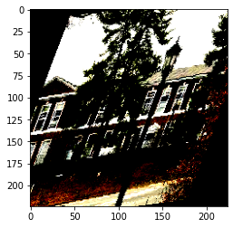

This is a dive into the power of transfer learning and my chance to get better at working with PyTorch. The goal of this project is to predict buildings at UVA (my alma mater) from their images. Below is my attempt at doing so :).

## Imports


```python
import torch
import torch.nn as nn
import torchvision
import numpy as np
from tqdm import tqdm
import time
import copy
from torch.utils.data import Dataset, Subset, random_split, DataLoader
import torchvision.transforms as transforms
import torchvision.datasets as datasets
import matplotlib.pyplot as plt
from google.colab import drive
import os
from torchsummary import summary

drive.mount('/content/drive')
%matplotlib inline
%cd drive/MyDrive/MSDS\ Spring/deeplearning
```

    Mounted at /content/drive
    /content/drive/.shortcut-targets-by-id/1eNAO8TfHfvKSUgq3DbaFUHpT7f4gcTwH/MSDS Spring/deeplearning


## Read and Explore Data

First lets set device if using GPU


```python
# Set device
device = torch.device("cuda" if torch.cuda.is_available() else "cpu")
print(device)

# Check for multiple gpus (I just came across this and wanted to have it in case i use it in the future, not using it during this)
if torch.cuda.is_available():
    gpu_count = torch.cuda.device_count()
    print(f'{gpu_count} gpus detected.')
    if gpu_count > 1:
        multi_gpu = True
    else:
        multi_gpu = False
```

    cuda
    1 gpus detected.


This is just for us to define functions and classes for data preprocessing which we will use later


```python
# Get mean and std
def getMeanStd(loader):
    """
    The function calculates the standard deviation and mean of an image set.

    Parameters:
    loader (DataLoader): Description of arg1
  
    Returns:
    mean (tensor): mean of image
    std (tensor): std of image
    """
    # var[X] = E[X**2] - E[X]**2
    channels_sum, channels_sqrd_sum, num_batches = 0, 0, 0

    for data, _ in tqdm(loader):
        channels_sum += torch.mean(data, dim=[0, 2, 3])
        channels_sqrd_sum += torch.mean(data ** 2, dim=[0, 2, 3])
        num_batches += 1

    mean = channels_sum / num_batches
    std = (channels_sqrd_sum / num_batches - mean ** 2) ** 0.5

    return mean, std

# Need to do this to add transformations to training but not to validation
class PrepData(Dataset):
    """
    This is a class to apply transformations to data
      
    Attributes:
        dataset: The dataset to apply transformations
        transform: the transforms to apply to the dataset.
    """
    
    def __init__(self, dataset, transform=None):
        self.dataset = dataset
        self.transform = transform

    def __getitem__(self, index):
        if self.transform:
            x = self.transform(dataset[index][0])
        else:
            x = dataset[index][0]
        y = dataset[index][1]
        return x, y
    
    def __len__(self):
        return len(dataset)
    
class PadImage(object):
    """
    This is a class to pad an image to make it a square. 
    Can be used in a torch.Compose block.
      
    Attributes:
        img: img to apply transformation to, not needed in a torch.Compose block.
    """

    def __call__(self, img):

        width, height = transforms.functional.get_image_size(img) 
        
        if width > height:
            height_padding = ((width - height) // 2)
            img = transforms.functional.pad(img, [0, height_padding])
        else:
            width_padding = ((height - width) // 2)
            img = transforms.functional.pad(img, [width_padding, 0])           

        return img

    def __repr__(self):
        return self.__class__.__name__+'()'
```

Get mean and standard deviation of train dataset to normalize our images (Only need to do this once so its commented out)


```python
# # Parameters
# data_dir = "./content/dataset"
# batch_size = 64
# img_height = 224
# img_width = 224
# train_size = 0.85
# num_workers = 2

# # Basic transformation for loading to get mean and std of data set
# datatransform = transforms.Compose([
#     transforms.ToTensor(),
#     transforms.Resize((img_height, img_width))
# ])

# # Load dataset
# dataset = datasets.ImageFolder(data_dir, transform=datatransform)

# # Create the index splits for training, validation and test
# num_train = len(dataset)
# indices = list(range(num_train))
# split = int(np.floor(train_size * num_train))
# np.random.seed(1999)
# np.random.shuffle(indices)
# train_idx, valid_idx = indices[:split], indices[split:]

# # Get mean and std of training subset (before transformations) - dont want to use test and valid for this part
# traindataset = PrepData(dataset)
# traindata = Subset(traindataset, indices=train_idx)
# trainloader = DataLoader(traindata, batch_size=batch_size, num_workers=num_workers, drop_last=True)
# mean, std = getMeanStd(trainloader)
```

lets now apply preprocessing and take a look at the data we have


```python
# Parameters
data_dir = "./content/dataset"
batch_size = 64
img_height = 224
img_width = 224
train_size = 0.85
num_workers = 2
mean = torch.tensor([0.4407, 0.4332, 0.4326])
std = torch.tensor([0.2520, 0.2610, 0.2906])

# Basic transformation for loading to get mean and std of data set

dataset = datasets.ImageFolder(data_dir)

# Create the index splits for training, validation and test (test we dont have any for this)
num_train = len(dataset)
indices = list(range(num_train))
split = int(np.floor(train_size * num_train))
np.random.seed(1999)
np.random.shuffle(indices)
train_idx, valid_idx = indices[:split], indices[split:]

# Set transforms
traintransform = transforms.Compose([
    transforms.ToTensor(),
    PadImage(),
    transforms.Resize((img_height, img_width)),
    transforms.ColorJitter(brightness=0.01),
    transforms.RandomAffine(degrees = 10, shear = 45),
    transforms.Normalize(mean, std)
])

testtransform = transforms.Compose([
    transforms.ToTensor(),
    PadImage(),
    transforms.Resize((img_height, img_width)),
    transforms.Normalize(mean, std)
])

# Apply transformations
traindataset = PrepData(dataset,traintransform)
valdataset = PrepData(dataset,testtransform)

# Use same subset as above
traindata = Subset(traindataset, indices=train_idx)
valdata = Subset(valdataset, indices=valid_idx)


trainloader = DataLoader(traindata, batch_size=batch_size,
                         num_workers=num_workers, drop_last=True)
validloader = DataLoader(valdata, batch_size=batch_size,
                         num_workers=num_workers, drop_last=True)

```

now lets visualize what our data looks like after transformations are applied


```python
dataiter = iter(trainloader)
images, labels = dataiter.next()
plt.imshow(np.transpose(images[1].cpu().detach().numpy(), (1, 2, 0)))
```





Looks pretty crazy, but these transformations will introduce bias to our network so it generalizes better.

we can finally get classes and count of classes to see if they are imbalanced.


```python
classes = sorted([x[0][len(data_dir) + 1:] for x in os.walk(data_dir)][1:])

class_count = dict(zip(classes, torch.unique(torch.tensor(dataset.targets), return_counts=True)[1].tolist()))

class_count
```


    {'AcademicalVillage': 408,
     'AldermanLibrary': 742,
     'AlumniHall': 457,
     'AquaticFitnessCenter': 556,
     'BravoHall': 200,
     'BrooksHall': 410,
     'ClarkHall': 849,
     'MadisonHall': 368,
     'MinorHall': 760,
     'NewCabellHall': 636,
     'NewcombHall': 716,
     'OldCabellHall': 832,
     'OlssonHall': 995,
     'RiceHall': 1460,
     'Rotunda': 1569,
     'ScottStadium': 1257,
     'ThorntonHall': 1219,
     'UniversityChapel': 857}


Now lets define the model were gonna use and get its summary. We are going to use a newer version of the resnet model (you can see more about it [here](https://arxiv.org/abs/2101.00590)).


```python
model = torchvision.models.regnet_y_16gf(pretrained=True)

# Freeze all the layers bar the last one
# for param in model.parameters():
#     param.requires_grad = False

output_units = len(class_count)
    
# Change the number of output units
model.fc = nn.Linear(3024, output_units)

# print summary (commented out because its long)
# summary(model.to(device),
#     input_size=(3, img_height, img_width), 
#     batch_size=batch_size, 
#     device='cuda')

```

    Downloading: "https://download.pytorch.org/models/regnet_y_16gf-9e6ed7dd.pth" to /root/.cache/torch/hub/checkpoints/regnet_y_16gf-9e6ed7dd.pth


      0%|          | 0.00/319M [00:00<?, ?B/s]


Now lets make sure model overfits on a small amount of data (one batch)


```python
# Network
model = model.to(device) 

#just in case i want to use multiple gpus (this is for my own personal use, not using it in this class)
if multi_gpu:
    model = nn.DataParallel(model)

# Loss and optimizer
optimizer = torch.optim.Adam(model.parameters(), lr=3e-4, weight_decay=.001)
criterion = nn.CrossEntropyLoss()
num_epochs = 100

data, targets = next(iter(trainloader))

# Train Network
for epoch in range(num_epochs):
    losses = []
    data = data.to(device=device)
    targets = targets.to(device=device)

    # forward
    scores = model(data)
    loss = criterion(scores, targets)

    losses.append(loss.item())
    
    # backward
    optimizer.zero_grad()
    loss.backward()

    # gradient descent or adam step
    optimizer.step()
    if epoch % 10 == 0:
        print(f"Cost at epoch {epoch} is {sum(losses)/len(losses):.5f}")

```

    Cost at epoch 0 is 2.86258
    Cost at epoch 10 is 2.12791
    Cost at epoch 20 is 1.55923
    Cost at epoch 30 is 1.09628
    Cost at epoch 40 is 0.75821
    Cost at epoch 50 is 0.53022
    Cost at epoch 60 is 0.38205
    Cost at epoch 70 is 0.28617
    Cost at epoch 80 is 0.22287
    Cost at epoch 90 is 0.17961


## Training

Start out by defining functions for training


```python
# Define functions
def save_checkpoint(state, filename="my_checkpoint.pth.tar"):
    print("=> Saving checkpoint")
    torch.save(state, filename)

def load_checkpoint(checkpoint, model, optimizer):
    print("=> Loading checkpoint")
    model.load_state_dict(checkpoint['state_dict'])
    optimizer.load_state_dict(checkpoint['optimizer'])

def train_one_epoch(loader, model, optimizer, loss_fn, scaler, device):
    for batch_idx, (data, targets) in enumerate(tqdm(loader)):
        # Get data to cuda if possible
        data = data.to(device=device)
        targets = targets.to(device=device)

        # forward
        with torch.cuda.amp.autocast():
            scores = model(data)
            loss = loss_fn(scores, targets)

        # backward
        optimizer.zero_grad()
        scaler.scale(loss).backward()
        scaler.step(optimizer)
        scaler.update()

def get_loss_accuracy(loader, model, loss_fn):
    num_correct = 0
    num_samples = 0

    running_loss = 0
    mean_loss = 0

    model.eval()

    with torch.no_grad():
        for i, (x, y) in enumerate(loader):
            x = x.to(device=device)
            y = y.to(device=device)

            scores = model(x)

            # update loss
            loss = loss_fn(scores, y)
            running_loss += loss.item()
            mean_loss = running_loss/(i+1)

            # update
            _, predictions = scores.max(1)
            num_correct += (predictions == y).sum()
            num_samples += predictions.size(0)

    accuracy = float(num_correct) / float(num_samples) * 100

    print(f'Loss: {mean_loss}')
    print(f'Got {num_correct} / {num_samples} with accuracy {accuracy:.2f}')

    model.train()

    return mean_loss, accuracy

def check_accuracy(loader, model):
    num_correct = 0
    num_samples = 0
    model.eval()

    with torch.no_grad():
        for x, y in loader:
            x = x.to(device=device)
            y = y.to(device=device)

            scores = model(x)
            _, predictions = scores.max(1)
            num_correct += (predictions == y).sum()
            num_samples += predictions.size(0)

        print(f'Got {num_correct} / {num_samples} with accuracy {float(num_correct) / float(num_samples) * 100:.2f}')

    model.train()

# Define Classes

class EarlyStopping():
    def __init__(self, max_epochs):
        self.max_epochs = max_epochs
        self.current_epochs = 0
        self.best_loss = np.inf

    def __call__(self, current_loss):
        if current_loss < self.best_loss:
            self.best_loss = current_loss
            self.current_epochs = 0
        else:
            self.current_epochs += 1
            if self.current_epochs >= self.max_epochs:
                print("Early Stopping!")
                return True

class SaveBestModel():
    def __init__(self):
        self.best_valid_loss = np.inf
        self.best_model = None
        
    def __call__(self, current_valid_loss, model, optimizer):
        if current_valid_loss < self.best_valid_loss:
            self.best_model = model
            self.best_valid_loss = current_valid_loss
            print(f"Best validation loss: {self.best_valid_loss}")
            checkpoint = {'state_dict': model.state_dict(), 'optimizer': optimizer.state_dict()}
            save_checkpoint(checkpoint, filename='best_model.pth')
        return self.best_model

```

Lets finally train the model! we are going to use early stopping so our model doesnt overfit. In the future we could finetune it by reducing the learning rate on plateaus, introducing more regularization, or try more architectures.


```python
## Define Hyperparameters
model = model.to(device)
epochs = 20
loss_fn = nn.CrossEntropyLoss()
optimizer = torch.optim.Adam(model.parameters(), lr=0.001)
scaler = torch.cuda.amp.GradScaler()
early_stopping = EarlyStopping(max_epochs = 3)
save_best_model = SaveBestModel()

## Train Model
for epoch in range(epochs): 
    train_one_epoch(trainloader, model, optimizer, loss_fn, scaler, device)
    valid_loss, valid_accuracy = get_loss_accuracy(validloader, model, loss_fn)
    best_model = save_best_model(valid_loss, model, optimizer)
    if early_stopping(valid_loss): break
    print(50 * '-')
```

    100%|██████████| 189/189 [07:43<00:00,  2.45s/it]


    Loss: 0.5207281618407278
    Got 1813 / 2112 with accuracy 85.84
    Best validation loss: 0.5207281618407278
    => Saving checkpoint
    --------------------------------------------------


    100%|██████████| 189/189 [07:43<00:00,  2.45s/it]


    Loss: 0.39420453346136847
    Got 1894 / 2112 with accuracy 89.68
    Best validation loss: 0.39420453346136847
    => Saving checkpoint
    --------------------------------------------------


    100%|██████████| 189/189 [07:43<00:00,  2.45s/it]


    Loss: 0.3432330150495876
    Got 1920 / 2112 with accuracy 90.91
    Best validation loss: 0.3432330150495876
    => Saving checkpoint
    --------------------------------------------------


    100%|██████████| 189/189 [07:43<00:00,  2.45s/it]


    Loss: 0.3180406294537313
    Got 1944 / 2112 with accuracy 92.05
    Best validation loss: 0.3180406294537313
    => Saving checkpoint
    --------------------------------------------------


    100%|██████████| 189/189 [07:43<00:00,  2.45s/it]


    Loss: 0.4523882418870926
    Got 1904 / 2112 with accuracy 90.15
    --------------------------------------------------


    100%|██████████| 189/189 [07:43<00:00,  2.45s/it]


    Loss: 0.3475282314148816
    Got 1952 / 2112 with accuracy 92.42
    --------------------------------------------------


    100%|██████████| 189/189 [07:43<00:00,  2.45s/it]


    Loss: 0.41245486745328613
    Got 1921 / 2112 with accuracy 90.96
    Early Stopping!


Finally, lets load our model and check our model accuracy


```python
# Load model
checkpoint = torch.load('my_checkpoint.pth.tar')

# Model
model = torchvision.models.regnet_y_16gf(pretrained=True)
output_units = len(class_count)
model.fc = nn.Linear(3024, output_units)
best_model = model.to(device)

# Optimizer
optimizer = torch.optim.Adam(best_model.parameters(), lr=0.001)

# Load Checkpoint
load_checkpoint(checkpoint, best_model, optimizer)
```


```python
check_accuracy(validloader, best_model)
```

    Got 1944 / 2112 with accuracy 92.05


Pretty good! and pretty easy to do!